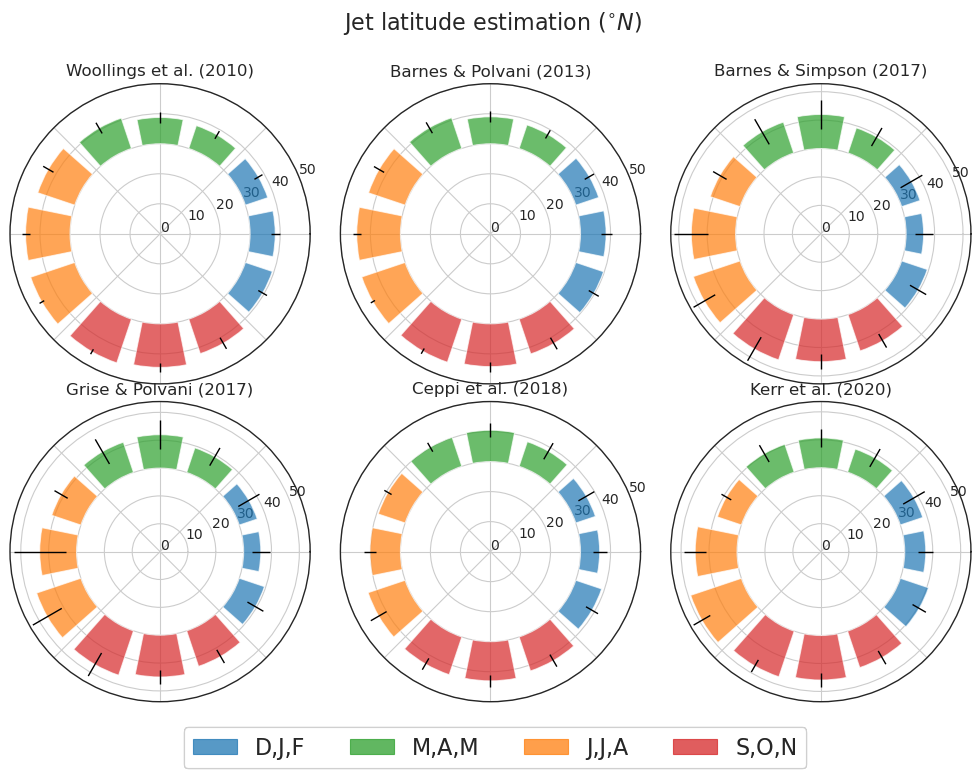
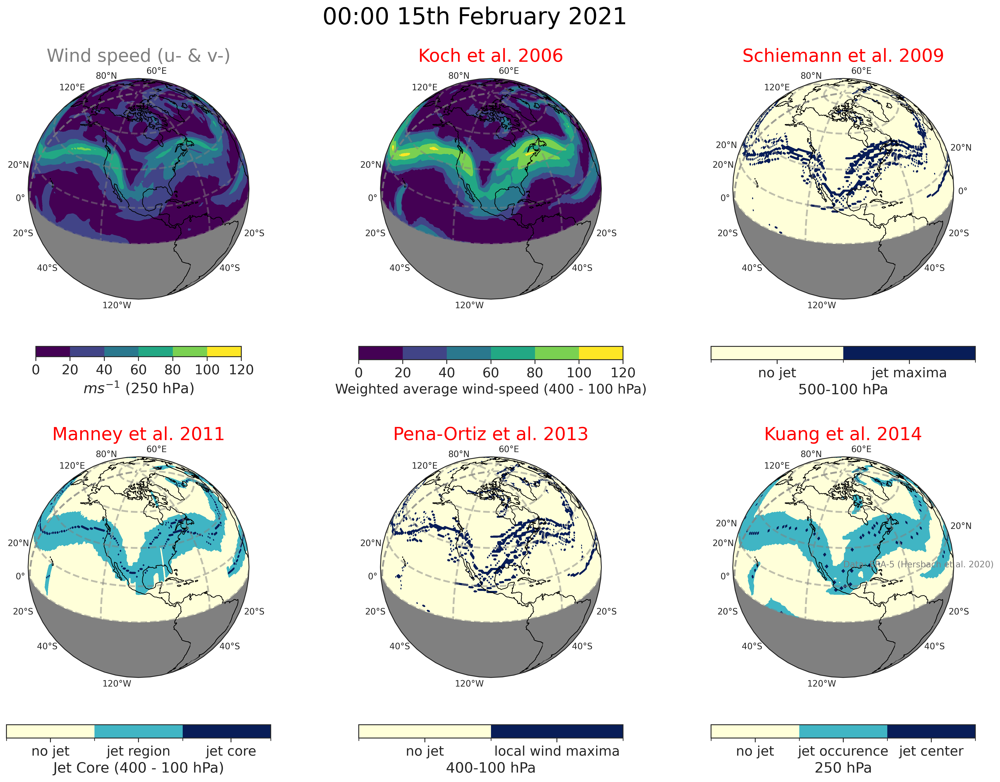

============================================
jsmetrics: Jet-stream metrics and algorithms
============================================

|pypi| |pre-commit| |codefactor| |coveralls| |docs| |license| |black| |zenodo|  
------------------------------------------------------------------------------
**preprint now available here: https://egusphere.copernicus.org/preprints/2023/egusphere-2023-661/**   
**example notebooks: https://github.com/Thomasjkeel/jsmetrics-examples**

This is jsmetrics, a package containing implementations of various metrics and algorithms for identifying or characterising jet-streams
written in Python and built from xarray.

.. WRITE WHY JET-STREAM (maybe in blog, maybe in readme) -> heatwaves, beast from the east, climate proxy (put it all down)
.. At the foundation of studies that look at jet-streams is the metric used to describe or characterise it.

.. WRITE CURRENT PROGRESS WITH MODULDE in highlighted section near the top of this readme 

The philosophy of this package was to keep the methodology of each metric as close as possible to the given research paper's description of it (if not exact),
*but* to not limit the method to a given:

        * time period,  
        * time unit (i.e. day, month, DJF),  
        * latitude/longitude resolution,  
        * region (where possible),  
        * pressure level height.  

All can be handled user-side.

.. 
        ALSO all algorithms have been broken down into various components and these components are not coupled to a given methodology.
        As such each can be used seperately and this allows users to rebuilt aspects of a methodology (e.g. to replace a filtering method)

Installation 
-------------
.. code-block:: bash
    
    pip install jsmetrics

Let me know if you have any problems installing this package, as I have not extensively tested for Mac-OS and Windows versions. 
    
Documentation
-------------
The official documentation is at https://jsmetrics.readthedocs.io/en/latest/  

My email is: thomas.keel.18@ucl.ac.uk. Please feel free to email me if you would like some help working with this package.

Usage
-------------
.. code-block:: python

 import xarray as xr
 import jsmetrics

 # load windspeed data with u- and v- component wind.
 uv_data = xr.open_dataset(filename)

 # run Woollings et al. 2010 metric
 w10 = jsmetrics.jet_statistics.woollings_et_al_2010(uv_data)

 print(w10['jet_lat'])
 print(w10['jet_speed'])

 # run Kuang et al. 2014 metric. NOTE: may take a long time after you have more than 50 time steps.
 k14 = jsmetrics.jet_core_algorithms.kuang_et_al_2014(uv_data)
 print(k14['jet_center'].sel(time=0))

Examples
-------------
Some example notebooks are available here: https://github.com/Thomasjkeel/jsmetrics-examples

*Estimation of North Pacific mean jet latitude by month with 1-stdev errorbars. Data is monthly ERA5 700-850 hPa u-wind between 1980-2020.*

*Comparison of jet core algorithms estimation of the 6-hourly jet position. Data is 6-hourly ERA5 100-500 hPa u-v-wind.*

.. image:: docs/_static/images/all_jet_lats_stj_pfj_npac_maps_more_metrics.png
  :width: 560
  :align: center
  :alt: STJ and PFJ by metric and longitude

*By latitude estimation of the jet latitude of the subtropical and polar jet stream. Data is monthly ERA5 differenced-250 hPa (orange) and 700-850 hPa (blue) u-wind between 1980-2020.*

DISCLAIMER
-------------
We have tried to replicate the various metrics based on the equations and details in the methodology as accurately as possible.
However, in some cases, we have chosen to exclude or alter parts of the methodology which reduce the resolution of the output (i.e. grouping into season or region) with the hope to preserve the parts of the method that specifically isolate a characteristics of the jet-stream at any inputted scale.
Again, any further subsetting is passed onto the user.
*If data input is at a daily resolution, part of the output should also be daily resolution.*  

Also note that, the data we used to test these metrics may have a different resolution to the one it was developed with.   

Finally, although these metric were found with a literature search, this is not an exaustive list of all methods used to identify or characterise the jet-stream or upper-level wind.
This project is very much a work in progress, so contributors are very welcome.

You can find details of each metric or algorithm here: `all metrics`_.

Where you can find my working-out (coming soon):
- I am hoping to make available all of my working out in jupyter-notebooks available soon (warning: these notebooks are not formatted) 
- I am also currently creating a verification notebook. 

Metrics & Algorithms
--------------------
See `all metrics`_ for specifications of each 'Complete' or 'In progress' metric and algorithm. For progress on their completion see `Status`_.

.. table::
   :align: left
   :widths: auto
   
   =============================================================================== ==============  ==  =============================================================================== ==============
   Metric/Algorithm                                                                `Status`_           Metric/Algorithm                                                                `Status`_                                                                                
   =============================================================================== ==============  ==  =============================================================================== ==============
   `Gallego et al. 2005 <http://link.springer.com/10.1007/s00382-005-0006-7>`_     To start            `Strong & Davis 2005 <http://doi.wiley.com/10.1029/2004GL022039>`_              To start
   `Koch et al. 2006 <https://onlinelibrary.wiley.com/doi/10.1002/joc.1255>`_      To verify           `Archer & Caldiera 2008 <http://doi.wiley.com/10.1029/2008GL033614>`_           To verify
   `Schiemann et al. 2009 <https://doi.org/10.1175/2008JCLI2625.1>`_               To verify           `Woollings et al. 2010 <https://onlinelibrary.wiley.com/doi/10.1002/qj.625>`_   Complete
   `Manney et al. 2011 <https://acp.copernicus.org/articles/11/6115/2011/>`_       In progess*         `Allen et al. 2012 <http://www.nature.com/articles/nature11097>`_               To start
   `Barnes & Polvani 2013 <https://doi.org/10.1175/JCLI-D-12-00536.1>`_            To verify           `Pena-Ortiz et al. 2013 <http://doi.wiley.com/10.1002/jgrd.50305>`_             To verify      
   `Screen & Simmonds 2013 <http://doi.wiley.com/10.1002/grl.50174>`_              In progress*        `Kuang et al. 2014 <http://link.springer.com/10.1007/s00704-013-0994-x>`_       To verify            
   `Barnes & Polvani 2015 <https://doi.org/10.1175/JCLI-D-14-00589.1>`_            To verify           `Francis & Vavrus 2015 <https://doi.org/10.1088/1748-9326/10/1/014005>`_        Complete            
   `Cattiaux et al. 2016 <https://doi.wiley.com/10.1002/2016GL070309>`_            To verify           `Barnes & Simpson 2017 <https://doi.org/10.1175/JCLI-D-17-0299.1>`_             Complete            
   `Chenoli et al. 2017 <http://link.springer.com/10.1007/s00382-016-3102-y>`_     In progress         `Grise & Polvani 2017 <https://doi.org/10.1175/JCLI-D-16-0849.1>`_              Complete                        
   `Molnos et al. 2017  <https://doi.org/10.5194/esd-8-75-2017>`_                  In progress*        `Adam et al. 2018 <https://doi.org/10.5194/gmd-11-4339-2018>`_                  To start            
   `Bracegirdle et al. 2018 <https://doi.org/10.1175/JCLI-D-17-0320.1>`_           Complete            `Ceppi et al. 2018 <https://doi.org/10.1175/JCLI-D-17-0323.1>`_                 Complete            
   `Kern et al. 2018 <http://ieeexplore.ieee.org/document/8017585/>`_              To start*           `Rikus 2018 <http://dx.doi.org/10.1007/s00382-015-2560-y>`_                     In progress            
   `Zappa et al. 2018 <https://doi.org/10.1029/2019GL083653>`_                     Complete            `Kern & Westermann 2019 <https://doi.org/10.2312/vmv.20191321>`_                To start
   `Kerr et al. 2020 <https://doi.org/10.1029/2020JD032735>`_                      To verify           `Maher et al. 2020 <https://doi.org/10.1007/s00382-019-05084-6>`_               To start
   `Winters et al. 2020 <https://doi.org/10.1175/MWR-D-19-0353.1>`_                To start            `Martin 2021 <https://onlinelibrary.wiley.com/doi/10.1029/2020JD033668>`_       To start*        
   `Bosiger et al. 2022 <https://doi.org/10.5194/gmd-15-1079-2022>`_               To start            `Local Wave Activity <https://doi.org/10.1175/JAS-D-15-0194.1>`_                In progress*                        
   =============================================================================== ==============  ==  =============================================================================== ==============

* == help needed

.. _all metrics: https://github.com/Thomasjkeel/jsmetrics/blob/main/details_for_all_metrics.py
.. _Status: https://github.com/Thomasjkeel/jsmetrics/projects/1

.. 
        _also mention related references (i.e. Manney et al. )
        also Local Wave Activity (maybe martineu?)
        Gallego

Contributing
------------
jsmetrics is in active development. 

* If you're interested in participating in the development of jsmetrics by suggesting new features, new metrics or algorithms or report bugs, please leave us a message on the `issue tracker`_

* If you would like to contribute code or documentation (which is greatly appreciated!), check out the `Contributing Guidelines`_ before you begin!

.. _issue tracker: https://github.com/Thomasjkeel/jsmetrics/issues
.. _Contributing Guidelines: https://jsmetrics.readthedocs.io/en/latest/contributing.html
.. How to cite this package
.. ------------------------
.. If you wish to cite `jsmetrics` in a research publication, we kindly ask that you use the bibliographical reference information available through `Zenodo`

Project To-Do's
---------------
        - WRITE a 'I would like to calculate... Table with which statistics you can get from which metrics, latitude, speed, width etc.'
        - FINISH verification notebook.
        - LOOK INTO timing/benchmarking the metrics (maybe in seperate github repo)
        - TO SOLVE: dealing with data from different sources (some sort of data translator module or maybe included in tests)
                - for example what if 'v' or 'v-wind' is passed to func instead of 'va' (answer: cf-xarray)  
                - for example what if 'mbar' or 'model levels' instead of 'plev' (answer: pint)
        - TO SOLVE: subsetting longitude if it wraps around 0-360
        - ADD: cf_xarray (see: https://cf-xarray.readthedocs.io/en/latest/index.html)
        - ADD: pint (see: https://pint.readthedocs.io/en/stable/)
        - ADD: var names to details_for_all_metrics

Credits
-------------

The layout and content of this project and was inspired by xclim (https://github.com/Ouranosinc/xclim) 
which contains other climate indices and metrics.

This package was created with Cookiecutter and the audreyr/cookiecutter-pypackage project template.

.. |license| image:: https://img.shields.io/github/license/thomasjkeel/jsmetrics
        :target: https://github.com/Thomasjkeel/jsmetrics/blob/master/LICENSE
        :alt: License

.. |black| image:: https://img.shields.io/badge/code%20style-black-000000.svg
        :target: https://github.com/python/black
        :alt: Python Black

.. |pre-commit| image:: https://results.pre-commit.ci/badge/github/Thomasjkeel/jsmetrics/main.svg
   :target: https://results.pre-commit.ci/latest/github/Thomasjkeel/jsmetrics/main
   :alt: pre-commit.ci status

.. |codefactor| image:: https://www.codefactor.io/repository/github/thomasjkeel/jsmetrics/badge
   :target: https://www.codefactor.io/repository/github/thomasjkeel/jsmetrics
   :alt: CodeFactor
   
.. |coveralls| image:: https://coveralls.io/repos/github/Thomasjkeel/jsmetrics/badge.svg?branch=main
   :target: https://coveralls.io/github/Thomasjkeel/jsmetrics?branch=main

.. |zenodo| image:: https://zenodo.org/badge/DOI/10.5281/zenodo.8123560.svg
        :target:  https://doi.org/10.5281/zenodo.8123560
        :alt: DOI
.. |docs| image:: https://readthedocs.org/projects/jsmetrics/badge/?version=latest
       :target: https://jsmetrics.readthedocs.io/en/latest/?badge=latest
       :alt: Documentation Status
.. |pypi| image:: https://img.shields.io/pypi/v/jsmetrics.svg
        :target: https://pypi.org/project/jsmetrics/
        :alt: Python Package Index Build

.. .. |conda| image:: https://img.shields.io/conda/vn/conda-forge/jsmetrics.svg
..         :target: https://anaconda.org/conda-forge/jsmetrics
..         :alt: Conda-forge Build Version
