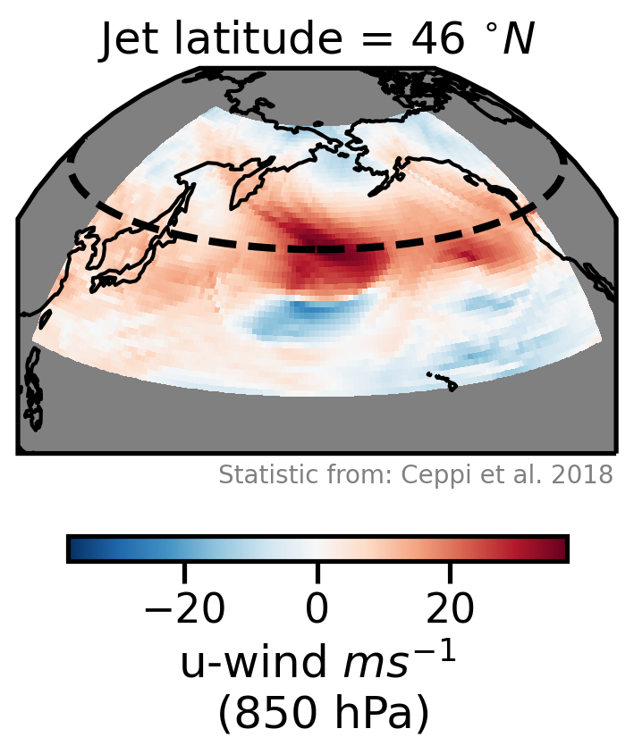
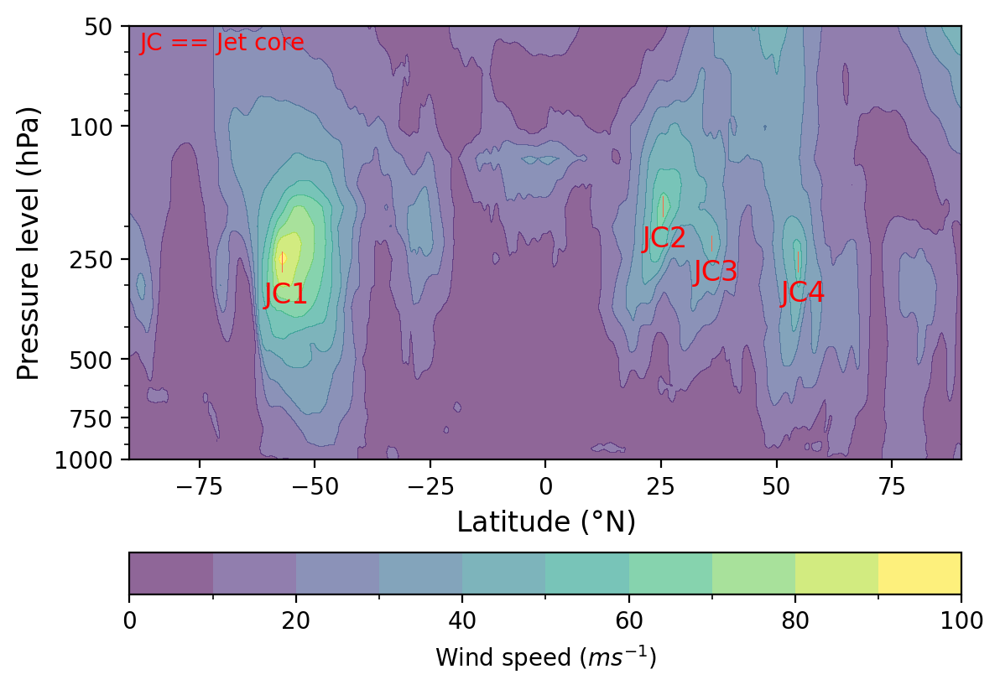
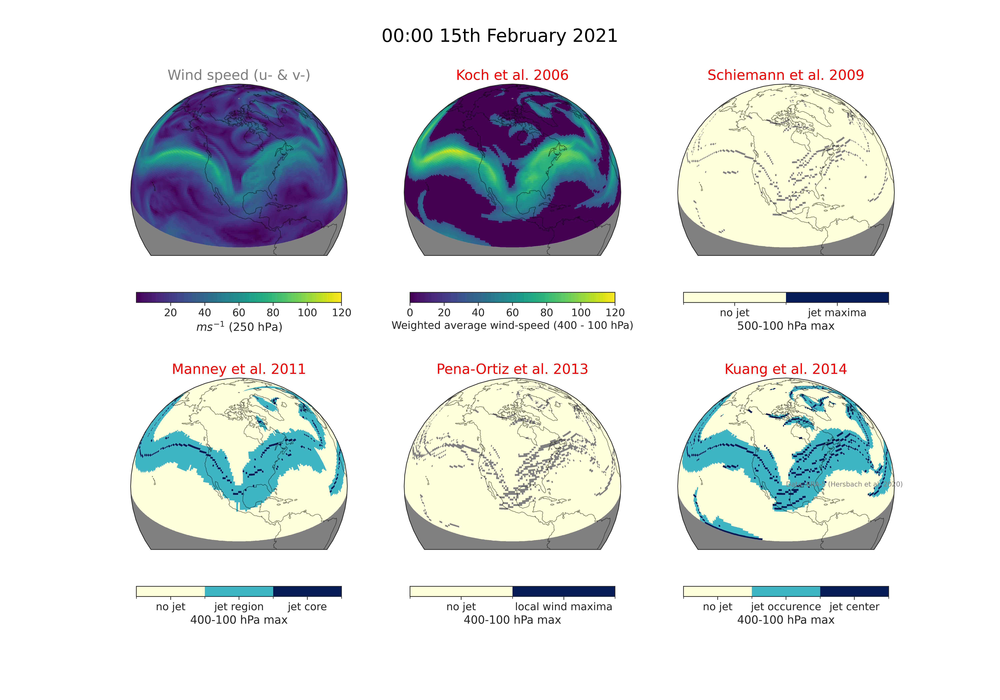

.. image:: https://github.com/Thomasjkeel/jsmetrics/blob/main/docs/logos/jsmetrics_logo_tiny.png
   :target: https://coveralls.io/github/Thomasjkeel/jsmetrics?branch=main
   :align: center
   :alt: jsmetrics

============================================
jsmetrics: Jet-stream metrics and algorithms
============================================
|pypi| |pre-commit| |codefactor| |coveralls| |openssf| |docs| |license| |black| |zenodo|

*jsmetrics* is an open-source Python package containing implementations of various statistics and algorithms which have been
developed to identify or characterise jet streams.

The package is built using `xarray <https://docs.xarray.dev/en/stable/>`_ and currently contains 17 methods,
consisting of jet statistics, waviness metrics and jet core algorithms (described `here <https://jsmetrics.readthedocs.io/en/latest/metrics.html>`_).
As this is an ongoing project, we are always in the process of finding and implementing new methods.
You can find a full list of methods and their current state in the `docs <https://jsmetrics.readthedocs.io/en/latest/index.html>`_.

--------------------------------------------------------------------------------------------------

GMD article describing jsmetrics v0.2.0:
   Keel, T., Brierley, C., and Edwards, T.: jsmetrics v0.2.0: a Python package for metrics and algorithms used to identify or characterise atmospheric jet streams, Geosci. Model Dev., 17, 1229–1247, https://doi.org/10.5194/gmd-17-1229-2024, 2024

example `notebooks <https://github.com/Thomasjkeel/jsmetrics-examples>`_

----

Installation
-------------
.. code-block:: bash

    pip install jsmetrics

Let me know if you have any problems installing this package, as I have not extensively tested for Mac-OS and Windows versions.

Documentation
-------------
The official documentation is at https://jsmetrics.readthedocs.io/en/latest/

My email is: thomasjames.keel@gmail.com. Please feel free to email me if you would like some help working with this package.

Usage
-------------
:code:`jsmetrics` is designed to be easy to use and should integrate seemlessly with `*xarray* <https://docs.xarray.dev/en/stable/>`_.
An extensive knowledge of Python or *xarray* is **not** required to use *jsmetrics*, although it will help you use the package
more effectively if you wish to run some of the more advanced use cases.

Below we introduce a simple use of the package to run a single jet statistic.

.. code-block:: python

 import xarray as xr
 import jsmetrics

 # load windspeed data with u- and v- component wind.
 uv_data = xr.open_dataset(filename)

 # run Woollings et al. 2010 metric
 w10 = jsmetrics.metrics.jet_statistics.woollings_et_al_2010(uv_data)

 print(w10['jet_lat'])
 print(w10['jet_speed'])

Examples
-------------
For examples please check out the examples here: https://jsmetrics.readthedocs.io/en/latest/usage.html

Some example notebooks are available on `GitHub <https://github.com/Thomasjkeel/jsmetrics-examples>`_

**Example of jet latitude statistic:**

*Example output of the jet latitude statistic from Ceppi et al. 2018 for 00:00 1st January 2021. Data is ERA5 850 hPa u-wind.*

**Example of jet core algorithm:**

*Example output of the jet core algorithm from Manney et al. 2011. The cores shown are extracted from a windspeed slice at 32E longitude at 12:00 on 1st January 2024. Data is 6-hourly ERA5 1000-50 hPa u-v-wind.*

**Compare jet core algorithms:**

*Comparison of jet core algorithms estimation of the 6-hourly jet position. Data is 6-hourly ERA5 500-100 hPa u-v-wind.*

**Ask questions with jet latitude statsitics:**

*Estimation of mean jet latitude shift. Data is monthly ERA5 850-700 hPa u-wind between 1990-2020.*

**Extend the original jet metric definitions using jsmetrics flexibility:**

.. image:: docs/_static/images/all_jet_lats_stj_pfj_npac_maps_more_metrics.png
  :width: 450
  :align: center
  :alt: STJ and PFJ by metric and longitude

*By latitude estimation of the jet latitude of the subtropical and polar jet stream. Data is monthly ERA5 differenced-250 hPa (orange) and 850-700 hPa (blue) u-wind between 1980-2020.*

.. *Why use jsmetrics?:*
.. ---------------------
.. The planet's jet streams are complex and not well defined at any one scale (see `what are jet streams <https://jsmetrics.readthedocs.io/en/latest/statement.html#what-are-jet-streams>`_),
.. and as such there are a wide range of metrics, algorithms and statistics which have been employed in research to help
.. identify and characterise them. However, it has been generally quite difficult to reconcile various types of information provided
.. by different techniques. The motivation for this package was thus to standardise the most common methods developed for the
.. identification and characterisation of jet streams, so that various techniques are immediately available for anyone wishing to
.. look at jet streams in data. Also, it is hoped that *jsmetrics* provides a foundation for new metrics and for researchers to be
.. able to quantitatively compare differences provided by existing techniques.

How to cite this package
------------------------
If you wish to cite `jsmetrics` in a research publication, we kindly ask that you use:

   Keel, T., Brierley, C., and Edwards, T.: jsmetrics v0.2.0: a Python package for metrics and algorithms used to identify or characterise atmospheric jet streams, Geosci. Model Dev., 17, 1229–1247, https://doi.org/10.5194/gmd-17-1229-2024, 2024

A reference to a specific version of this software is also available through Zenodo e.g.:

   Keel, T.: Thomasjkeel/jsmetrics: v0.2.2 (0.2.2), Zenodo [code], https://doi.org/10.5281/zenodo.10822662, 2024.

Contributing
------------
jsmetrics is in active development.

* If you're interested in participating in the development of jsmetrics by suggesting new features, new metrics or algorithms or report bugs, please leave us a message on the `issue tracker`_

* If you would like to contribute code or documentation (which is greatly appreciated!), check out the `Contributing Guidelines`_ before you begin!

.. _issue tracker: https://github.com/Thomasjkeel/jsmetrics/issues
.. _Contributing Guidelines: https://jsmetrics.readthedocs.io/en/latest/contributing.html

Credits
-------------
The layout and content of this project and was inspired by xclim (https://github.com/Ouranosinc/xclim)
which contains other climate indices and metrics.

This package was created with Cookiecutter and the audreyr/cookiecutter-pypackage project template.

Disclaimer
-------------
We have tried to replicate the various metrics based on the equations and details in the methodology as accurately as possible.
However, in some cases, we have chosen to exclude or alter parts of the methodology which reduce the resolution of the output (i.e. grouping into season or region) with the hope to preserve the parts of the method that specifically isolate a characteristics of the jet-stream at any inputted scale.
Again, any further subsetting is passed onto the user.
*If data input is at a daily resolution, part of the output should also be daily resolution.*

Also note that, the data we used to test these metrics may have a different resolution to the one it was developed with.

Finally, although these metric were found with a literature search, this is not an exaustive list of all methods used to identify or characterise the jet-stream or upper-level wind.
This project is very much a work in progress, so contributors are very welcome.

.. |license| image:: https://img.shields.io/github/license/thomasjkeel/jsmetrics
        :target: https://github.com/Thomasjkeel/jsmetrics/blob/master/LICENSE
        :alt: License

.. |black| image:: https://img.shields.io/badge/code%20style-black-000000.svg
        :target: https://github.com/python/black
        :alt: Python Black

.. |pre-commit| image:: https://results.pre-commit.ci/badge/github/Thomasjkeel/jsmetrics/main.svg
   :target: https://results.pre-commit.ci/latest/github/Thomasjkeel/jsmetrics/main
   :alt: pre-commit.ci status

.. |codefactor| image:: https://www.codefactor.io/repository/github/thomasjkeel/jsmetrics/badge
   :target: https://www.codefactor.io/repository/github/thomasjkeel/jsmetrics
   :alt: CodeFactor

.. |coveralls| image:: https://coveralls.io/repos/github/Thomasjkeel/jsmetrics/badge.svg?branch=main
   :target: https://coveralls.io/github/Thomasjkeel/jsmetrics?branch=main

.. |zenodo| image:: https://zenodo.org/badge/DOI/10.5281/zenodo.10822662.svg
        :target: https://doi.org/10.5281/zenodo.10822662
        :alt: Zenodo

.. |docs| image:: https://readthedocs.org/projects/jsmetrics/badge/?version=latest
       :target: https://jsmetrics.readthedocs.io/en/latest/?badge=latest
       :alt: Documentation Status

.. |pypi| image:: https://img.shields.io/pypi/v/jsmetrics.svg
        :target: https://pypi.org/project/jsmetrics/
        :alt: Python Package Index Build

.. |openssf| image:: https://api.scorecard.dev/projects/github.com/Thomasjkeel/jsmetrics/badge
            :target: https://scorecard.dev/viewer/?uri=github.com/Thomasjkeel/jsmetrics
            :alt: OpenSSF scorecard

.. .. |conda| image:: https://img.shields.io/conda/vn/conda-forge/jsmetrics.svg
..         :target: https://anaconda.org/conda-forge/jsmetrics
..         :alt: Conda-forge Build Version
