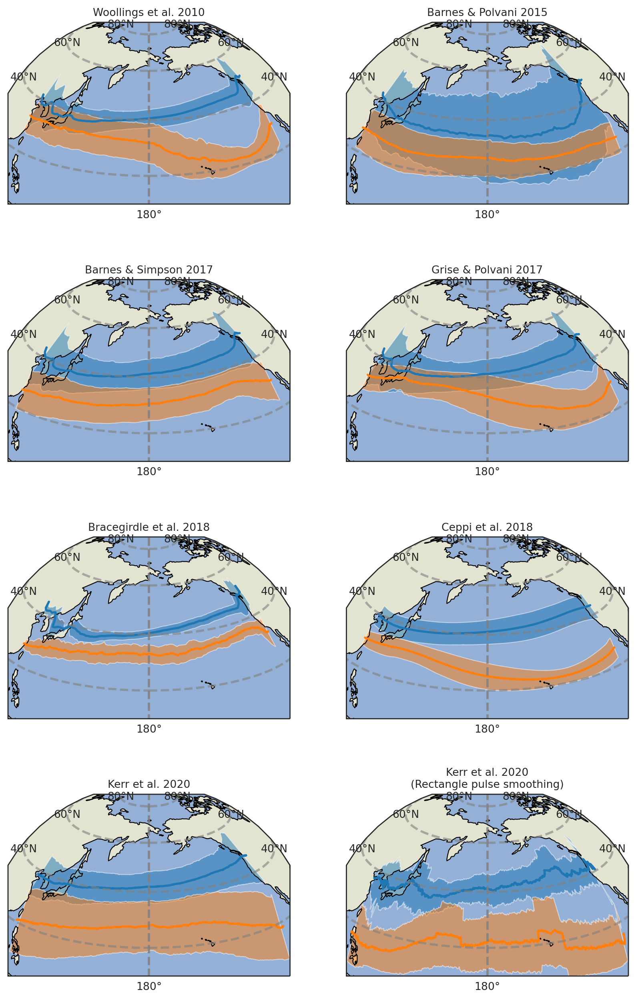

.. image:: https://github.com/Thomasjkeel/jsmetrics/blob/main/docs/logos/jsmetrics_logo_tiny.png
   :target: https://coveralls.io/github/Thomasjkeel/jsmetrics?branch=main
   :align: center
   :alt: jsmetrics

============================================
jsmetrics: Jet-stream metrics and algorithms
============================================

|pypi| |pre-commit| |codefactor| |coveralls| |docs| |license| |black| |zenodo|  
------------------------------------------------------------------------------
**preprint now available here: https://egusphere.copernicus.org/preprints/2023/egusphere-2023-661/**   
**example notebooks: https://github.com/Thomasjkeel/jsmetrics-examples**

This is jsmetrics, a package containing implementations of various metrics and algorithms for identifying or characterising jet-streams
written in Python and built from xarray.

*Why use jsmetrics?:*

The planet's jet streams are complex and not well defined at any one scale (see `what are jet streams <https://jsmetrics.readthedocs.io/en/latest/statement.html#what-are-jet-streams>`_),
and as such there are a wide range of metrics, algorithms and statistics which have been employed in research to help
identify and characterise them. However, it has been generally quite difficult to reconcile various types of information provided
by different techniques. The motivation for this package was thus to standardise the most common methods developed for the
identification and characterisation of jet streams, so that various techniques are immediately available for anyone wishing to
look at jet streams in data. Also, it is hoped that *jsmetrics* provides a foundation for new metrics and for researchers to be
able to quantitatively compare differences provided by existing techniques. 

Installation 
-------------
.. code-block:: bash
    
    pip install jsmetrics

Let me know if you have any problems installing this package, as I have not extensively tested for Mac-OS and Windows versions. 
    
Documentation
-------------
The official documentation is at https://jsmetrics.readthedocs.io/en/latest/  

My email is: thomas.keel.18@ucl.ac.uk. Please feel free to email me if you would like some help working with this package.

Usage
-------------
:code:`jsmetrics` is designed to be easy to use and should integrate seemlessly with `*xarray* <https://docs.xarray.dev/en/stable/>`_. 
An extensive knowledge of Python or *xarray* is **not** required to use *jsmetrics*, although it will help you use the package
more effectively if you wish to run some of the more advanced use cases. 

Below we introduce a simple use of the package to run a single jet statistic.

.. code-block:: python

 import xarray as xr
 import jsmetrics

 # load windspeed data with u- and v- component wind.
 uv_data = xr.open_dataset(filename)

 # run Woollings et al. 2010 metric
 w10 = jsmetrics.metrics.jet_statistics.woollings_et_al_2010(uv_data)

 print(w10['jet_lat'])
 print(w10['jet_speed'])

Examples
-------------
For examples please check out the `examples <https://jsmetrics.readthedocs.io/en/latest/usage.html>`_

Some example notebooks are available here: https://github.com/Thomasjkeel/jsmetrics-examples

.. image:: docs/_static/images/jet_core_algorithm_comparions_NA_5_texas2021.png
  :width: 560
  :align: center
  :alt: Comparison of jet core algorithms during Feb 2021 Texas Cold Wave

*Comparison of jet core algorithms estimation of the 6-hourly jet position. Data is 6-hourly ERA5 100-500 hPa u-v-wind.*

.. image:: docs/_static/images/all_metrics_jetlat_circbar_w_errorbars.png
  :width: 560
  :align: center
  :alt: Jet latitude circbars with errorbars

*Estimation of North Pacific mean jet latitude by month with 1-stdev errorbars. Data is monthly ERA5 700-850 hPa u-wind between 1980-2020.*

*By latitude estimation of the jet latitude of the subtropical and polar jet stream. Data is monthly ERA5 differenced-250 hPa (orange) and 700-850 hPa (blue) u-wind between 1980-2020.*

DISCLAIMER
-------------
We have tried to replicate the various metrics based on the equations and details in the methodology as accurately as possible.
However, in some cases, we have chosen to exclude or alter parts of the methodology which reduce the resolution of the output (i.e. grouping into season or region) with the hope to preserve the parts of the method that specifically isolate a characteristics of the jet-stream at any inputted scale.
Again, any further subsetting is passed onto the user.
*If data input is at a daily resolution, part of the output should also be daily resolution.*  

Also note that, the data we used to test these metrics may have a different resolution to the one it was developed with.   

Finally, although these metric were found with a literature search, this is not an exaustive list of all methods used to identify or characterise the jet-stream or upper-level wind.
This project is very much a work in progress, so contributors are very welcome.

You can find details of each metric or algorithm here: `all metrics`_.

Metrics & Algorithms
--------------------
See `all metrics`_ for specifications of each 'Complete' or 'In progress' metric and algorithm. For progress on their completion see `Status`_.

.. table::
   :align: left
   :widths: auto
   
   =============================================================================== ==============  ==  =============================================================================== ==============
   Metric/Algorithm                                                                `Status`_           Metric/Algorithm                                                                `Status`_                                                                                
   =============================================================================== ==============  ==  =============================================================================== ==============
   `Gallego et al. 2005 <http://link.springer.com/10.1007/s00382-005-0006-7>`_     To start            `Strong & Davis 2005 <http://doi.wiley.com/10.1029/2004GL022039>`_              To start
   `Koch et al. 2006 <https://onlinelibrary.wiley.com/doi/10.1002/joc.1255>`_      Complete            `Archer & Caldiera 2008 <http://doi.wiley.com/10.1029/2008GL033614>`_           Complete
   `Schiemann et al. 2009 <https://doi.org/10.1175/2008JCLI2625.1>`_               Complete            `Woollings et al. 2010 <https://onlinelibrary.wiley.com/doi/10.1002/qj.625>`_   Complete
   `Manney et al. 2011 <https://acp.copernicus.org/articles/11/6115/2011/>`_       To verify           `Allen et al. 2012 <http://www.nature.com/articles/nature11097>`_               To start
   `Barnes & Polvani 2013 <https://doi.org/10.1175/JCLI-D-12-00536.1>`_            Complete            `Pena-Ortiz et al. 2013 <http://doi.wiley.com/10.1002/jgrd.50305>`_             To verify      
   `Screen & Simmonds 2013 <http://doi.wiley.com/10.1002/grl.50174>`_              In progress*        `Grise & Polvani 2014 <https://doi.org/10.1002/2013GL058466>`_                  Complete 
   `Kuang et al. 2014 <http://link.springer.com/10.1007/s00704-013-0994-x>`_       To verify           `Barnes & Polvani 2015 <https://doi.org/10.1175/JCLI-D-14-00589.1>`_            Complete
   `Francis & Vavrus 2015 <https://doi.org/10.1088/1748-9326/10/1/014005>`_        Complete            `Cattiaux et al. 2016 <https://doi.wiley.com/10.1002/2016GL070309>`_            To verify           
   `Barnes & Simpson 2017 <https://doi.org/10.1175/JCLI-D-17-0299.1>`_             Complete            `Chenoli et al. 2017 <http://link.springer.com/10.1007/s00382-016-3102-y>`_     In progress                                
   `Bracegirdle et al. 2018 <https://doi.org/10.1175/JCLI-D-17-0320.1>`_           Complete            `Ceppi et al. 2018 <https://doi.org/10.1175/JCLI-D-17-0323.1>`_                 Complete            
   `Rikus 2018 <http://dx.doi.org/10.1007/s00382-015-2560-y>`_                     In progress         `Zappa et al. 2018 <https://doi.org/10.1029/2019GL083653>`_                     Complete
   `Kerr et al. 2020 <https://doi.org/10.1029/2020JD032735>`_                      To verify           `Maher et al. 2020 <https://doi.org/10.1007/s00382-019-05084-6>`_               To start
   `Bosiger et al. 2022 <https://doi.org/10.5194/gmd-15-1079-2022>`_               To start            `Local Wave Activity <https://doi.org/10.1175/JAS-D-15-0194.1>`_                In progress*                        
   =============================================================================== ==============  ==  =============================================================================== ==============

* == help needed

.. _all metrics: https://github.com/Thomasjkeel/jsmetrics/blob/main/jsmetrics/details_for_all_metrics.py
.. _Status: https://github.com/Thomasjkeel/jsmetrics/projects/1

.. 
        _also mention related references (i.e. Manney et al. )
        also Local Wave Activity (maybe martineu?)
        Gallego

Contributing
------------
jsmetrics is in active development. 

* If you're interested in participating in the development of jsmetrics by suggesting new features, new metrics or algorithms or report bugs, please leave us a message on the `issue tracker`_

* If you would like to contribute code or documentation (which is greatly appreciated!), check out the `Contributing Guidelines`_ before you begin!

.. _issue tracker: https://github.com/Thomasjkeel/jsmetrics/issues
.. _Contributing Guidelines: https://jsmetrics.readthedocs.io/en/latest/contributing.html
.. How to cite this package
.. ------------------------
.. If you wish to cite `jsmetrics` in a research publication, we kindly ask that you use the bibliographical reference information available through `Zenodo`

Project To-Do's
---------------
        - ADD: cf_xarray (see: https://cf-xarray.readthedocs.io/en/latest/index.html)
        - ADD: pint (see: https://pint.readthedocs.io/en/stable/)

Credits
-------------

The layout and content of this project and was inspired by xclim (https://github.com/Ouranosinc/xclim) 
which contains other climate indices and metrics.

This package was created with Cookiecutter and the audreyr/cookiecutter-pypackage project template.

.. |license| image:: https://img.shields.io/github/license/thomasjkeel/jsmetrics
        :target: https://github.com/Thomasjkeel/jsmetrics/blob/master/LICENSE
        :alt: License

.. |black| image:: https://img.shields.io/badge/code%20style-black-000000.svg
        :target: https://github.com/python/black
        :alt: Python Black

.. |pre-commit| image:: https://results.pre-commit.ci/badge/github/Thomasjkeel/jsmetrics/main.svg
   :target: https://results.pre-commit.ci/latest/github/Thomasjkeel/jsmetrics/main
   :alt: pre-commit.ci status

.. |codefactor| image:: https://www.codefactor.io/repository/github/thomasjkeel/jsmetrics/badge
   :target: https://www.codefactor.io/repository/github/thomasjkeel/jsmetrics
   :alt: CodeFactor
   
.. |coveralls| image:: https://coveralls.io/repos/github/Thomasjkeel/jsmetrics/badge.svg?branch=main
   :target: https://coveralls.io/github/Thomasjkeel/jsmetrics?branch=main

.. |zenodo| image:: https://zenodo.org/badge/DOI/10.5281/zenodo.8123560.svg
        :target:  https://doi.org/10.5281/zenodo.8123560
        :alt: DOI
.. |docs| image:: https://readthedocs.org/projects/jsmetrics/badge/?version=latest
       :target: https://jsmetrics.readthedocs.io/en/latest/?badge=latest
       :alt: Documentation Status
.. |pypi| image:: https://img.shields.io/pypi/v/jsmetrics.svg
        :target: https://pypi.org/project/jsmetrics/
        :alt: Python Package Index Build

.. .. |conda| image:: https://img.shields.io/conda/vn/conda-forge/jsmetrics.svg
..         :target: https://anaconda.org/conda-forge/jsmetrics
..         :alt: Conda-forge Build Version
