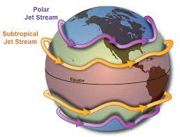

==============
Why jsmetrics?
==============
The planet's jet streams are complex and not well defined at any one scale (see :ref:`what are jet streams <What are jet streams?>`),
and as such there are a wide range of metrics, algorithms and statistics which have been employed in research to help
identify and characterise them. However, it has been generally quite difficult to reconcile various types of information
provided by different techniques. The motivation for this package was thus to standardise the most common methods developed for the
identification and characterisation of jet streams, so that various techniques are immediately available for anyone wishing to
look at jet streams in data. Also, it is hoped that *jsmetrics* provides a foundation for new metrics and for researchers to be
able to quantitatively compare differences provided by existing techniques.

For more information about the standardisation process of the metrics into Python, see :ref:`the philosophy of jsmetrics <The philosophy of *jsmetrics*>`.

For a quick overview for the sort of things jsmetrics will help you do, see our :ref:`quick start <Quick start>` section below.

Quick start
-----------
.. table::
   :align: left
   :widths: auto

   +--------------------------------------------------------+-------------------------------------------------------------------+
   | I would like to...                                     | Reccomendation                                                    |
   +========================================================+===================================================================+
   | Read in wind-speed data from NetCDF (.nc) or GRIB      | | Python's *xarray* library can read in climate data in a .nc     |
   | (.grib) format                                         | | or .grib format by default. And all metrics in *jsmetrics*      |
   |                                                        | | have been implementated to work with *xarray* data types.       |
   +--------------------------------------------------------+-------------------------------------------------------------------+
   | Rename data coords so that they are compatible with    | | Python's *xarray* library provide functions to `rename`_ data   |
   |  jsmetrics e.g. to standarise names (i.e. lat, lon).   | | and we provide some basic examples of renaming your data        |
   |                                                        | | :ref:`here <4. Renaming data coords>`                           |
   +--------------------------------------------------------+-------------------------------------------------------------------+
   | Merge u and v components of wind                       | | Python's *xarray* library can `merge`_ data, but be careful     |
   |                                                        | | that the data you are merging has the exact same time, lat      |
   |                                                        | | and lon dimensions, otherwise the merge can take a long time.   |
   +--------------------------------------------------------+-------------------------------------------------------------------+
   | Know the mean position of the jet stream               | | The most common method for this would be to calculate the       |
   |                                                        | | 'jet latitude', which are provided by *jsmetrics* under the     |
   |                                                        | | :ref:`jet statistics <jet statistics>` group of methods.        |
   |                                                        | | Around 9 jet latitude methods are available in this package,    |
   |                                                        | | the most commonly used is 'woollings_et_al_2010'.               |
   +--------------------------------------------------------+-------------------------------------------------------------------+
   | Know the average speed of the jet stream               | | The most common method for this would be to calculate the       |
   |                                                        | | 'jet speed', which are provided by *jsmetrics* under the        |
   |                                                        | | :ref:`jet statistics <jet statistics>` group of methods.        |
   |                                                        | | Around 8 jet speed methods are available in this package,       |
   |                                                        | | the most commonly used is 'woollings_et_al_2010'.               |
   +--------------------------------------------------------+-------------------------------------------------------------------+
   | Make a map of the jet stream                           | | Methods for identifying the coordinates of jets on are provided |
   |                                                        | | by the :ref:`jet core algorithms <jet core algorithms>` group   |
   |                                                        | | of methods available in *jsmetrics*. These methods all produce  |
   |                                                        | | masks of the latitude/longitude/level coordinates where a given |
   |                                                        | | algorithm has discovered jet cores. Our reccomendation is to    |
   |                                                        | | use 'koch_et_al_2006', which provides a weighted windspeed  or  |
   |                                                        | | 'manney_et_al_2011' which will seperate different jet cores     |
   |                                                        | | within the same region. Be warned that most of the 5 jet core   |
   |                                                        | | algorithms available are computationally expensive, so read the |
   |                                                        | | docstring of a given method for information about the run time. |
   +--------------------------------------------------------+-------------------------------------------------------------------+
   | Know the waviness of the jet stream or upper-air flow  | | Methods for quantifying the waviness of the jet stream are      |
   |                                                        | | provided by the :ref:`waviness metrics <waviness metrics>`      |
   |                                                        | | available in *jsmetrics*. These are fairly quick to run methods |
   |                                                        | | and there are currently only two available in this package.     |
   +--------------------------------------------------------+-------------------------------------------------------------------+
   | ...                                                    | | Please send me an email if you would like some more help the    |
   |                                                        | | package.                                                        |
   +--------------------------------------------------------+-------------------------------------------------------------------+

What are jet streams?
---------------------
Jet streams are features of the atmospheric circulation that manifest as fast-flowing ribbons of air, usually around
8-12 km above the surface.
They are generated and maintained in regions with extreme temperature gradients. These extreme gradients are produced
on the Earth by two major processes: (1) disturbances in the zonal mean-flow (known as eddy-driven processes) and (2)
conservation of angular momentum at the poleward edge of the Hadley Cell (known as thermally-driven processes).

In general, these processes create two major types of jets at a climatological scale in each Hemisphere (see Figure 1):

   1. the Polar Front Jet (PFJ) -- a deep and primarily eddy-driven feature
   2. the Subtropical Jet (STJ) -- a shallow and primarily thermally-driven feature

   Figure 1. Idealised view of the planet's jet streams

Figure 1 shows a idealised version of the jet streams -- clearly seperated and flowing circumglobal west-to-east fashion.
As you can imagine, in reality, the location, strength and direction of a given jet stream is not well defined at any scale.
They also exhibit fairly strong seasonality (generally moving closer to the Equator in colder months, and closer to the poles
in warmer ones). To see what we mean, we reccomend having a play with `Earth null school <https://earth.nullschool.net/#2021/02/15/1700Z/wind/isobaric/250hPa/orthographic=-91.82,32.12,310>`_
for one view of how jet stream-like features manifest on the planet (i.e. at 250-850 hPa).

The complexity in their structure, and lack of strong definition (they are essential just 'atmospheric phenomena') means that a
vast range of metrics, statistics and algorithms have been employed to identify and characterise different aspects of them in
atmospheric data. With *jsmetrics*, we have tried to include as many of the most common methods used to characterise jet streams
as possible in the hope that this would help researchers reconcile information about them and allow for a more quantitative
comparison of their differences and impact on trends and changes shown to the jet streams.

*I am still writing this section, so please email me if you have some suggestions or feedback.*

The philosophy of *jsmetrics*
-----------------------------
The philosophy of this package was to keep the methodology of each metric as close as possible to the given research paper's description of it (if not exact),
*but* to not limit the method to a given:

        * time period,
        * time unit (i.e. day, month, DJF),
        * latitude/longitude resolution,
        * region (where possible),
        * pressure level height.

The motivation for this was to allow the user to handle these factors and allow for the comparison of various metrics on the same underlying data.

Disclaimer
----------
We have tried to replicate the various metrics based on the equations and details in the methodology as accurately as possible.
However, in some cases, we have chosen to exclude or alter parts of the methodology which reduce the resolution of the output (i.e. grouping into season or region) with the hope to preserve the parts of the method that specifically isolate a characteristics of the jet-stream at any inputted scale.
Again, any further subsetting is passed onto the user.
*If data input is at a daily resolution, part of the output should also be daily resolution.*

Also note that, the data we used to test these metrics may have a different resolution to the one it was developed with.

Finally, although these metric were found with a literature search, this is not an exaustive list of all methods used to identify or characterise the jet-stream or upper-level wind.
This project is very much a work in progress, so contributors are very welcome.

.. Built from sub-components
.. ----------------------------
.. All statistics and algorithms in this package are built ontop of various one-purpose functions which we refer to as 'sub-components'.
.. These sub-component functions should have one role (e.g. to calculate atmospheric mass at a given atmospheric level), and should allow yet to be added metrics an easier implementation.

.. _merge: https://docs.xarray.dev/en/stable/generated/xarray.merge.html
.. _rename: https://docs.xarray.dev/en/stable/generated/xarray.Dataset.rename.html
