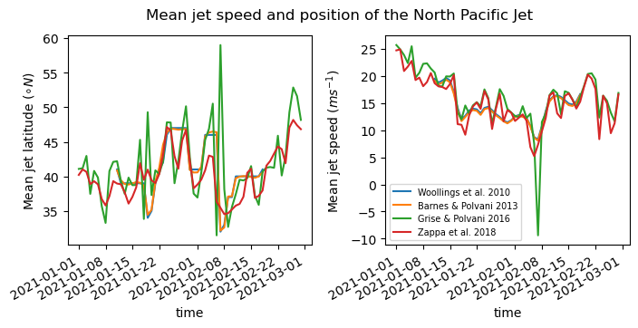
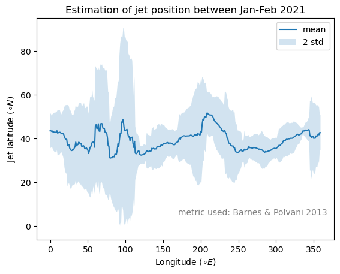
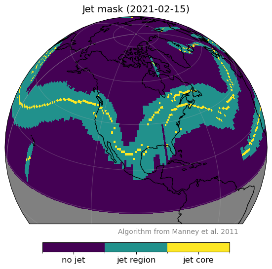

===============
Examples of Use
===============

:code:`jsmetrics` is designed to be easy to use and should integrate seemlessly with `*xarray* <https://docs.xarray.dev/en/stable/>`_ 
(which is a Python library useful for dealing with earth science datasets).
An extensive knowledge of Python or *xarray* is **not** required to use *jsmetrics*, although it will help you use the package
more effectively if you wish to run some of the more advanced use cases. 

.. note:: 
    To run any metric in :code:`jsmetrics` the syntax will be something like:

    .. code-block:: python

        import jsmetrics
        import xarray as xr

        # Use xarray to load in NetCDF or GRIB format data
        your_data = xr.open_dataset('path_to_your_data.nc')

        # Run a metric on your data and store the outputs 
        output = jsmetrics.<jet_module>.<jet_metric>(your_data)

*jsmetrics* provides three :ref:`types <Statistics & Algorithms>` of metric, we provide examples for each of them:
    1. :ref:`Jet statistics <1. Using the jet statistics>` 
    2. :ref:`Jet core algorithms <2. Using the jet core algorithms>`
    3. :ref:`Waviness metrics <3. Using the waviness metrics>`

*Please note that we also provide some examples in a jupyter notebook format available* `here <https://github.com/Thomasjkeel/jsmetrics-examples>`_.

1. Using the jet statistics 
###########################
...to compare estimations of jet latitude and speed
---------------------------------------------------
The most simple use of the jet statistics is to just run them on the same dataset. Below we use the Wintertime (J,F)
lower tropospheric North Pacific jet as an example. More detail is provided about the exact regions each jet statistics
was developed for in the file: `details_for_all_metrics.py <https://github.com/Thomasjkeel/jsmetrics/blob/main/jsmetrics/details_for_all_metrics.py>`_ 

.. code-block:: python

    import jsmetrics.metrics.jet_statistics as jet_statistics
    import xarray as xr
    import matplotlib.pyplot as plt

    # Load in dataset with the variable 'ua' and coordinates: 'time', 'plev', 'lon' and 'lat':
    u_data = xr.open_dataset('path_to_u_data')

    # Subset to a study area of interest, in this case the wintertime lower tropospheric North Pacific Jet (20-70 N, 135-235 E)
    u_sub = u_data.sel(time=slice("2021-01", "2021-02"), plev=slice(700, 850), lat=slice(20, 70), lon=slice(135, 235))

    # Select and run a few jet statistics
    w10 = jet_statistics.woollings_et_al_2010(u_sub, window_size=20, filter_freq=5)
    bp13 = jet_statistics.barnes_polvani_2013(u_sub, window_size=20, filter_freq=5)
    gp16 = jet_statistics.grise_polvani_2016(u_sub)
    z18 = jet_statistics.zappa_et_al_2018(u_sub)
    all_metrics = [w10, bp13, gp16, z18]

    # Plot a time series of the jet latitude and speed estimations
    fig, axes = plt.subplots(1, 2, sharex=True, figsize=(8, 3))
    for metric in all_metrics:
        metric['jet_lat'].plot(ax=axes[0])
        metric['jet_speed'].plot(ax=axes[1])

    axes[0].set_ylabel("Mean jet latitude ($\circ N$)")
    axes[1].legend(['Woollings et al. 2010', 'Barnes & Polvani 2013',\
                    'Grise & Polvani 2016', 'Zappa et al. 2018'], fontsize=7)
    axes[1].set_ylabel("Mean jet speed ($m s^{-1}$)")

    fig.suptitle('Mean jet speed and position of the North Pacific Jet')
    plt.subplots_adjust(wspace=.3)

   Example 1. Example comparison of jet latitude and speed statistics as determined by four of the jet statistics included in *jsmetrics*

...to calculate the jet latitude by longitude
---------------------------------------------
In this second example, we introduce how jsmetrics allows you to run a given jet statistic outside of its original purpose.
In this case to run the jet statistic on each longitude in the input dataset, similar to the method from `Liu et al. 2021 <https://agupubs.onlinelibrary.wiley.com/doi/10.1029/2021JD034876>`_

.. code-block:: python

    import jsmetrics.metrics.jet_statistics as jet_statistics
    import xarray as xr
    import matplotlib.pyplot as plt

    # Load in dataset with the variable 'ua' and coordinates: 'time', 'plev', 'lon' and 'lat':
    u_data = xr.open_dataset('path_to_u_data')

    # Subset to a given season and hemisphere (for purpose of the example)
    u_sub = u_data.sel(time=slice("2021-01", "2021-02"), lat=slice(0, 90))

    # In this example we will use the jet latitude statistic from Grise & Polvani 2016
    jet_statistics_to_use = jet_statistics.grise_polvani_2016

    # Define a function that will allow us to calculate a given metric for each longitude in our input data.
    def calc_jet_lat_by_lon(data_row, jet_statistic_func):
        """
        Calculates jet latitude for each longitude in the input data
        """
        data_row = data_row.expand_dims('lon')
        data_row['jet_lat'] = jet_lat_func(data_row)['jet_lat']
        data_row = data_row.isel(lon=0)
        data_row = data_row.drop('ua')
        return data_row
    
    # May take a few minute for 60 days 
    output = u_sub.groupby('lon').map(calc_jet_lat_by_lon, (jet_statistics_to_use,))

    # Extract the by longitude mean and standard devation
    mean_jet_lat = output['jet_lat'].mean(axis=1)
    std_jet_lat = output['jet_lat'].std(axis=1).dropna('lon')
    jet_lons = mean_jet_lat['lon']
    std2_above = (mean_jet_lat + (std_jet_lat*2))
    std2_below = (mean_jet_lat - (std_jet_lat*2))

    # Plot the outputs (It is possible to do this on a globe with Python's Cartopy.ccrs module)
    fig, ax = plt.subplots(1)
    mean_jet_lat.plot(ax=ax)
    ax.fill_between(jet_lons, std2_above, std2_below, alpha=0.2)
    ax.legend(['mean', '2 std'])
    ax.set_xlabel("Longitude ($\circ E$)")
    ax.set_ylabel("Jet latitude ($\circ N$)")

   Example 2. By longitude estimation of the jet latitude in the Northern Hemisphere as determined by Grise & Polvani 2016 method. Notice how the Atlantic and Pacific have relatively low variability.

2. Using the jet core algorithms 
################################

...as a spatial mask on other variables (such as windspeed)
-----------------------------------------------------------
Because all the jet core algorithm included in this package return 0 for regions not detected as the jet,
we can use xarray's `.where()` method to select a subset of another variable (i.e. windspeed)
within the boundaries of the detected jet.

.. code-block:: python

    import jsmetrics.metrics.jet_core_algorithms as jet_core_algorithms
    import xarray as xr
    import matplotlib.pyplot as plt # for plotting, not essential
    import cartopy.crs as ccrs # for plotting, not essential 

    # Load in dataset with the variables 'ua', 'va' and coordinates: 'time', 'plev', 'lon' and 'lat':
    uv_data = xr.open_dataset('path_to_uv_data')

    # Subset dataset to a sensible range for the purpose of this example (100-400 hPa &.0-90 N, 220-300 E)):
    uv_sub = uv_data.sel(time="2021-02-15", plev=slice(100, 400), lat=slice(0, 90), lon=slice(220-300))

    # Run algorithm:
    ## Set parameters for the algorithm
    jet_core_plev_limit = (100, 400) # let's ask the algorithm to look for jet cores between 100-400 hPa
    jet_core_ws_threshold = 40 # Jet cores will have windspeeds of a minimum of 40 m/s.
    jet_boundary_ws_threshold = 30 # Jet boundaries around the cores will be defines as regions with windspeeds of a minimum of 30 m/s.
    
    ## The algorithm run should take about 5 seconds
    manney_outputs = jet_core_algorithms.manney_et_al_2011(uv_sub), jet_core_plev_limit=jet_core_plev_limit, jet_core_ws_threshold=jet_core_ws_threshold, jet_boundary_ws_threshold=jet_boundary_ws_threshold)

    # Instead of looking at one pressure level, lets take the maximum from each level.
    jet_boundaries = manney_outputs['jet_region_mask'].max('plev')
    jet_cores = manney_outputs['jet_core_mask'].max('plev')

    # Use the jet occurence values as a mask to extract the jet occurence windspeeds
    schiemann_jet_ws = schiemann.where(schiemann['jet_occurence'] > 0)['ws']

   Figure 1. Idealised view of the planet's jet streams

...to produce a count of jet cores:
------------------------------------
If you want to look at the frequency of jet locations and produce a map.

.. code-block:: python

    import jsmetrics
    import xarray as xr

    # Load in dataset with u and v components:
    uv_data = xr.open_dataset('path_to_uv_data')

    # Subset dataset to range used in original methodology (100-500 hPa & 16.7-58.25 N, 42.5-220.5 E)):
    uv_sub = uv_data.sel(plev=slice(100, 500), lat=slice(16.7, 58.25), lon=slice(42.5, 220.5))

    # Run algorithm:
    schiemann_outputs = jsmetrics.jet_core_algorithms.schiemann_et_al_2009(uv_sub, ws_threshold=30)

    # Produce a jet occurence count across all pressure levels
    schiemann_jet_counts_all_levels = schiemann['jet_occurence'].sum(('time', 'plev'))

.. figure:: _static/images/simple_jet_globe_diagram.jpeg
   :align: center
   :alt: Earth's two major jet streams

   Figure 1. Idealised view of the planet's jet streams

3. Using the waviness metrics 
#############################
.. code-block:: python

    import jsmetrics
    import xarray as xr

    # Load in dataset with u and v components:
    uv_data = xr.open_dataset('path_to_uv_data')

    # Subset dataset to range used in original methodology (100-500 hPa & 16.7-58.25 N, 42.5-220.5 E)):
    uv_sub = uv_data.sel(plev=slice(100, 500), lat=slice(16.7, 58.25), lon=slice(42.5, 220.5))

    # Run algorithm:
    schiemann_outputs = jsmetrics.jet_core_algorithms.schiemann_et_al_2009(uv_sub, ws_threshold=30)

    # Produce a jet occurence count across all pressure levels
    schiemann_jet_counts_all_levels = schiemann['jet_occurence'].sum(('time', 'plev'))

.. figure:: _static/images/simple_jet_globe_diagram.jpeg
   :align: center
   :alt: Earth's two major jet streams

   Figure 1. Idealised view of the planet's jet streams

4. Running the jsmetrics in batch 
#################################
If you have lots of different sources of data, and you would like to calculate   
