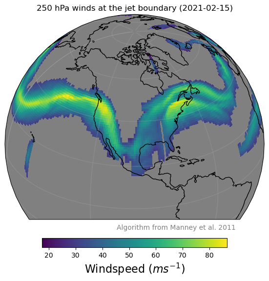
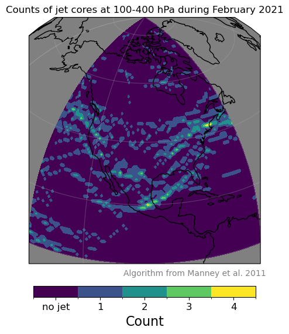
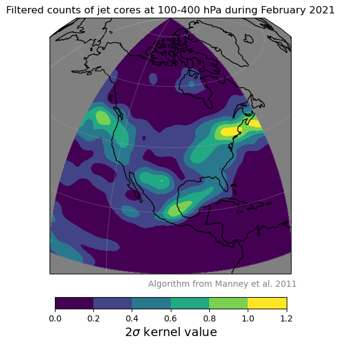
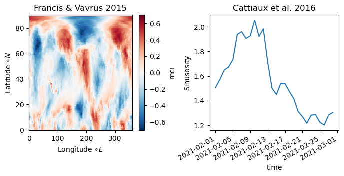

===============
Examples of Use
===============

:code:`jsmetrics` is designed to be easy to use and should integrate seemlessly with `*xarray* <https://docs.xarray.dev/en/stable/>`_ 
(which is a Python library useful for dealing with earth science datasets).
An extensive knowledge of Python or *xarray* is **not** required to use *jsmetrics*, although it will help you use the package
more effectively if you wish to run some of the more advanced use cases. 

.. note:: 
    To run any metric in :code:`jsmetrics` the syntax will be something like:

    .. code-block:: python

        import jsmetrics
        import xarray as xr

        # Use xarray to load in NetCDF or GRIB format data
        your_data = xr.open_dataset('path_to_your_data.nc')

        # Run a metric on your data and store the outputs 
        output = jsmetrics.<jet_module>.<jet_metric>(your_data)

*jsmetrics* provides three :ref:`types <Statistics & Algorithms>` of metric, we provide examples for each of them:
    1. :ref:`Jet statistics <1. Using the jet statistics>` 
    2. :ref:`Jet core algorithms <2. Using the jet core algorithms>`
    3. :ref:`Waviness metrics <3. Using the waviness metrics>`

*Please note that we also provide some examples in a jupyter notebook format available* `here <https://github.com/Thomasjkeel/jsmetrics-examples>`_.

1. Using the jet statistics 
###########################
...to compare estimations of jet latitude and speed
---------------------------------------------------
The most simple use of the jet statistics is to just run them on the same dataset. Below we use the Wintertime (J,F)
lower tropospheric North Pacific jet as an example. More detail is provided about the exact regions each jet statistics
was developed for in the file: `details_for_all_metrics.py <https://github.com/Thomasjkeel/jsmetrics/blob/main/jsmetrics/details_for_all_metrics.py>`_ 

.. code-block:: python

    import jsmetrics.metrics.jet_statistics as jet_statistics
    import xarray as xr
    import matplotlib.pyplot as plt

    # Load in dataset with the variable 'ua' and coordinates: 'time', 'plev', 'lon' and 'lat':
    u_data = xr.open_dataset('path_to_u_data')

    # Subset to a study area of interest, in this case the wintertime lower tropospheric North Pacific Jet (20-70 N, 135-235 E)
    u_sub = u_data.sel(time=slice("2021-01", "2021-02"), plev=slice(700, 850), lat=slice(20, 70), lon=slice(135, 235))

    # Select and run a few jet statistics
    w10 = jet_statistics.woollings_et_al_2010(u_sub, window_size=20, filter_freq=5)
    bp13 = jet_statistics.barnes_polvani_2013(u_sub, window_size=20, filter_freq=5)
    gp14 = jet_statistics.grise_polvani_2014(u_sub)
    z18 = jet_statistics.zappa_et_al_2018(u_sub)
    all_metrics = [w10, bp13, gp14, z18]

    # Plot a time series of the jet latitude and speed estimations
    fig, axes = plt.subplots(1, 2, sharex=True, figsize=(8, 3))
    for metric in all_metrics:
        metric['jet_lat'].plot(ax=axes[0])
        metric['jet_speed'].plot(ax=axes[1])

    axes[0].set_ylabel("Mean jet latitude ($\circ N$)")
    axes[1].legend(['Woollings et al. 2010', 'Barnes & Polvani 2013',\
                    'Grise & Polvani 2016', 'Zappa et al. 2018'], fontsize=7)
    axes[1].set_ylabel("Mean jet speed ($m s^{-1}$)")

    fig.suptitle('Mean jet speed and position of the North Pacific Jet')
    plt.subplots_adjust(wspace=.3)

   Example 1. Example comparison of jet latitude and speed statistics as determined by four of the jet statistics included in *jsmetrics*. Data is from the ERA5 and is in a 1*1 degree resolution.

...to calculate the jet latitude by longitude
---------------------------------------------
In this second example, we introduce how jsmetrics allows you to run a given jet statistic outside of its original purpose.
In this case to run the jet statistic on each longitude in the input dataset, similar to the method from `Liu et al. 2021 <https://agupubs.onlinelibrary.wiley.com/doi/10.1029/2021JD034876>`_

.. code-block:: python

    import jsmetrics.metrics.jet_statistics as jet_statistics
    import xarray as xr
    import matplotlib.pyplot as plt

    # Load in dataset with the variable 'ua' and coordinates: 'time', 'plev', 'lon' and 'lat':
    u_data = xr.open_dataset('path_to_u_data')

    # Subset to a given season and hemisphere (for purpose of the example)
    u_sub = u_data.sel(time=slice("2021-01", "2021-02"), lat=slice(0, 90))

    # In this example we will use the jet latitude statistic from Grise & Polvani 2014
    jet_statistics_to_use = jet_statistics.grise_polvani_2014

    # Define a function that will allow us to calculate a given metric for each longitude in our input data.
    def calc_jet_lat_by_lon(data_row, jet_statistic_func):
        """
        Calculates jet latitude for each longitude in the input data
        """
        data_row = data_row.expand_dims('lon')
        data_row['jet_lat'] = jet_lat_func(data_row)['jet_lat']
        data_row = data_row.isel(lon=0)
        data_row = data_row.drop('ua')
        return data_row
    
    # May take a few minute for 60 days 
    output = u_sub.groupby('lon').map(calc_jet_lat_by_lon, (jet_statistics_to_use,))

    # Extract the by longitude mean and standard devation
    mean_jet_lat = output['jet_lat'].mean(axis=1)
    std_jet_lat = output['jet_lat'].std(axis=1).dropna('lon')
    jet_lons = mean_jet_lat['lon']
    std2_above = (mean_jet_lat + (std_jet_lat*2))
    std2_below = (mean_jet_lat - (std_jet_lat*2))

    # Plot the outputs (It is possible to do this on a globe with Python's Cartopy.ccrs module)
    fig, ax = plt.subplots(1)
    mean_jet_lat.plot(ax=ax)
    ax.fill_between(jet_lons, std2_above, std2_below, alpha=0.2)
    ax.legend(['mean', '2 std'])
    ax.set_xlabel("Longitude ($\circ E$)")
    ax.set_ylabel("Jet latitude ($\circ N$)")

   Example 2. By longitude estimation of the jet latitude in the Northern Hemisphere as determined by Grise & Polvani 2014 method. Notice how the Atlantic and Pacific have relatively low variability. Data is from the ERA5 and is in a 1*1 degree resolution.

2. Using the jet core algorithms 
################################

...to mask other variables (such as windspeed)
-----------------------------------------------------------
Because all the jet core algorithm included in this package return 0 for regions not detected as the jet,
we can use xarray's `.where()` method to select a subset of another variable (i.e. windspeed)
within the boundaries of the detected jet (where values are >0).

.. code-block:: python

    import jsmetrics
    import jsmetrics.metrics.jet_core_algorithms as jet_core_algorithms
    import xarray as xr
    import matplotlib.pyplot as plt # for plotting, not essential
    import cartopy.crs as ccrs # for plotting, not essential 

    # Load in dataset with the variables 'ua', 'va' and coordinates: 'time', 'plev', 'lon' and 'lat':
    uv_data = xr.open_dataset('path_to_uv_data')

    # Subset dataset to a sensible range for the purpose of this example (100-400 hPa &.0-90 N, 220-300 E):
    uv_sub = uv_data.sel(time="2021-02-15", plev=slice(100, 400), lat=slice(0, 90), lon=slice(220-300))

    # Run algorithm:
    ## Set parameters for the algorithm
    jet_core_plev_limit = (100, 400) # let's ask the algorithm to look for jet cores between 100-400 hPa
    jet_core_ws_threshold = 40 # Jet cores will have windspeeds of a minimum of 40 m/s.
    jet_boundary_ws_threshold = 30 # Jet boundaries around the cores will be defines as regions with windspeeds of a minimum of 30 m/s.
    
    ## The algorithm run should take about 5-15 seconds depending on CPI
    manney_outputs = jet_core_algorithms.manney_et_al_2011(uv_sub, jet_core_plev_limit=jet_core_plev_limit, jet_core_ws_threshold=jet_core_ws_threshold, jet_boundary_ws_threshold=jet_boundary_ws_threshold)

    # Instead of looking at one pressure level, lets take the maximum from each level.
    jet_regions = manney_outputs['jet_region_mask'].max('plev')
    jet_cores = manney_outputs['jet_core_mask'].max('plev')

    # Plot the mask outputs from Manney et al. 2011 (see Example 3.1)
    projection = ccrs.Orthographic(central_latitude=30, central_longitude=-100) # set the map projection and view

    fig, ax = plt.subplots(1, figsize=(7, 7), subplot_kw={'projection': projection, 'facecolor':"grey"})
    p = (jet_regions + jet_cores).plot(cmap=cmap, norm=norm,
                                    cbar_kwargs={'orientation':'horizontal', 'shrink':.7,\
                                                'pad':.07, 'spacing':'uniform',\
                                                'ticks':[0.5, 1.5, 2.5]},\
                                    transform=ccrs.PlateCarree())
    p.colorbar.set_ticklabels(["no jet", "jet region", "jet core"], size=12)
    ax.coastlines()
    ax.gridlines(alpha=.3)
    ax.set_title("Jet mask (2021-02-15)", size=14)
    fig.text(s='Algorithm from Manney et al. 2011', x=0.46, y=0.25, c='grey')

   Example 3.1 Example of the binary mask returned by the jet core algorithm from Manney et al. 2011. Jet cores (yellow) and jet regions (green) are shown for the 15th February 2021. Data is from the ERA5 and is in a 1*1 degree resolution.

While a mask is useful for visualising the coordinates of the jet, we can also use to extract other fields that are within the same coordinates from xarray data e.g. windspeed, see below:

.. code-block:: python

    # Calculate windspeed from u and v components
    uv_sub['ws'] = jsmetrics.utils.windspeed_utils.get_resultant_wind(uv_sub['ua'], uv_sub['va'])

    # Select 250 hPa windspeed in jet regions using the jet boundaries calculated by the algorithm from Manney et al. 2011
    jet_ws = uv_sub.sel(time="2021-02-15", plev=250).where(jet_boundaries)['ws']

    # Plot the resulting windspeed at the same coordinates as the jet region 
    fig, ax = plt.subplots(1, figsize=(7, 7), subplot_kw={'projection': projection, 'facecolor':"grey"})
    p = jet_ws.plot(transform=ccrs.PlateCarree(), cbar_kwargs={'orientation':'horizontal', 'shrink':.7, 'pad': .07})
    ax.coastlines()
    ax.gridlines(alpha=.3)
    ax.set_title("250 hPa winds at the jet boundary (2021-02-15)")
    p.colorbar.set_label("Windspeed ($ms^{-1}$)", size=16)
    fig.text(s='Algorithm from Manney et al. 2011', x=0.46, y=0.25, c='grey')

   Example 3.2 Wind speeds at the jet region at 250 hPa as determined by the jet core algorithm from Manney et al. 2011. Data is from the ERA5 and is in a 1*1 degree resolution.

...to produce a count of jet cores:
------------------------------------
If you want to look at the frequency of jet locations, below we provide a simple example of how to produce a count of jet core
events over a given region. In this example we use Manney et al. 2011 and only use data from February 2021.

.. code-block:: python

    import jsmetrics.metrics.jet_core_algorithms as jet_core_algorithms
    import xarray as xr
    import matplotlib.pyplot as plt # for plotting, not essential
    import cartopy.crs as ccrs # for plotting, not essential 

    # Load in dataset with the variables 'ua', 'va' and coordinates: 'time', 'plev', 'lon' and 'lat':
    uv_data = xr.open_dataset('path_to_uv_data')

    # Subset dataset to a sensible range for the purpose of this example (Feb 2021, 100-400 hPa &.0-90 N, 220-300 E):
    uv_sub = uv_data.sel(time="2021-02", plev=slice(100, 400), lat=slice(0, 90), lon=slice(220,300))

    # The algorithm run should take around 40-120 seconds depending on CPU
    ## We also set a lower threshold for jet cores (30 m/s)
    manney_outputs = jet_core_algorithms.manney_et_al_2011(uv_sub, jet_core_plev_limit=(100, 400),\
                                                                     jet_core_ws_threshold=30) 

    # Produce a jet core count across all pressure levels
    manney_jet_counts_feb21 = manney_outputs['jet_core_mask'].sum(('time', 'plev'))

    # Plot the counts
    projection = ccrs.Orthographic(central_latitude=30, central_longitude=-100) # set the map projection and view

    fig, ax = plt.subplots(1, figsize=(7, 7), subplot_kw={'projection': projection, 'facecolor':"grey"})
    p = manney_jet_counts_feb21.plot.contourf(levels=[0, 0.5, 1.5, 2.5, 3.5, 4.5], transform=ccrs.PlateCarree(), cbar_kwargs={'orientation':'horizontal',\
                                                        'ticks':[0.25, 1, 2, 3, 4], 'shrink':.7, 'pad': .07})
    p.colorbar.set_ticklabels(['no jet', 1, 2, 3, 4], size=12)
    ax.coastlines()
    ax.gridlines(alpha=.3)
    ax.set_title("Counts of jet cores at 100-400 hPa during February 2021")
    p.colorbar.set_label("Count", size=16)
    fig.text(s='Algorithm from Manney et al. 2011', x=0.46, y=0.25, c='grey')

   Example 4.1 Counts of jet cores during February 2021 at 100-400 hPa over North America as determined by the jet core algorithm from Manney et al. 2011. Data is from the ERA5 and is in a 1*1 degree resolution.

Depending on the resolution of the initial data (in this case we are using 1 degree latitude by 1 degree longitude), the output of the jet counts
may be sporadic. In the next example we show you how you could use a gaussian filter to smooth the jet counts. 

.. code-block:: python

    import scipy.ndimage as ndimage

    # Smooth the counts using a 2-sigma gaussian filter
    manney_jet_counts_feb21_gaussian = ndimage.gaussian_filter(manney_jet_counts_feb21, sigma=2.0, order=0)
    
    # Save new filtered cores to outputs
    manney_outputs['jet_cores_gaussian'] = (('lat', 'lon'), manney_jet_counts_feb21_gaussian)

    # Plot smoothed values
    fig, ax = plt.subplots(1, figsize=(7, 7), subplot_kw={'projection': projection, 'facecolor':"grey"})
    p = manney_outputs['jet_cores_gaussian'].plot.contourf(transform=ccrs.PlateCarree(), cbar_kwargs={'orientation':'horizontal', 'shrink':.7, 'pad': .07})
    ax.coastlines()
    ax.gridlines(alpha=.3)
    ax.set_title("Filtered counts of jet cores at 100-400 hPa during February 2021")
    p.colorbar.set_label("2$\sigma$ kernel value", size=14)
    fig.text(s='Algorithm from Manney et al. 2011', x=0.46, y=0.25, c='grey')

   Example 4.2 Gaussian filtered counts of jet cores during February 2021 at 100-400 hPa over North America as determined by the jet core algorithm from Manney et al. 2011. Data is from the ERA5 and is in a 1*1 degree resolution.

3. Using the waviness metrics 
#############################
While there are only two waviness metrics in *jsmetrics* as of version 0.6 (15th Sept 2023). There may be more in the future.
Currently, there is one sinuosity metric which uses geopotential height (zg) (Cattiaux et al., 2016) and one meridional circulation
metric which uses u- and v-components of wind (Francis & Vavrus, 2015).

...a simple use
---------------

.. code-block:: python

    import jsmetrics.metrics.waviness_metrics as waviness_metrics
    import xarray as xr

    # Load in dataset with the variables 'ua', 'va' and coordinates: 'time', 'plev', 'lon' and 'lat':
    uv_data = xr.open_dataset('path_to_uv_data')
    # Load in dataset with a geopotential height variable: 'zg' and coordinates: 'time', 'plev', 'lon' and 'lat':
    zg_data = xr.open_dataset('path_to_zg_data')

    # Subset the datasets to a sensible range for the purpose of this example (Feb 2021, 500 hPa &.0-90 N, 220-300 E):
    uv_sub = uv_data.sel(time="2021-02", plev=500, lat=slice(0, 90), lon=slice(220,300))
    zg_sub = uv_data.sel(time="2021-02", plev=500, lat=slice(0, 90), lon=slice(220,300))

    # Run metrics
    mci = waviness_metrics.francis_vavrus_2015(uv_sub)
    c16 = waviness_metrics.cattiaux_et_al_2016(zg_sub)

    # Take mean of MCI
    mci_feb21 = mci['mci'].mean('time')

    # Plot Sinuosity and MCI
    fig, axes = plt.subplots(1, 2, figsize=(8, 4))
    mci_feb21.plot(ax=axes[0])
    c16['sinuosity'].plot(ax=axes[1])
    axes[0].set_ylabel("Latitude $\circ N$")
    axes[0].set_xlabel("Longitude $\circ E$")
    axes[0].set_title("Francis & Vavrus 2015")
    axes[1].set_ylabel("Sinusosity")
    axes[1].set_title("Cattiaux et al. 2016")
    fig.subplots_adjust(wspace=.4)    

   Example 5. Meridional Circulation Index and Sinuosity from the two waviness metrics available in *jsmetrics*. Data is from the ERA5 and is in a 1*1 degree resolution.

4. Running the jsmetrics in batch 
#################################
*Work in progress, please email me if you are interested*

If you have lots of different sources of data, and you would like to calculate various jet statistics on the fly from your data 
(i.e. on JASMIN), we reccomend leaning on specification files which store information about metrics and subsetting like the 
'details_for_all_metrics.py' available in this package. It is my (Tom) intention to upload the scripts which I have personally used to run
and log outputs of various similar metrics from *jsmetrics* in batch on JASMIN.
